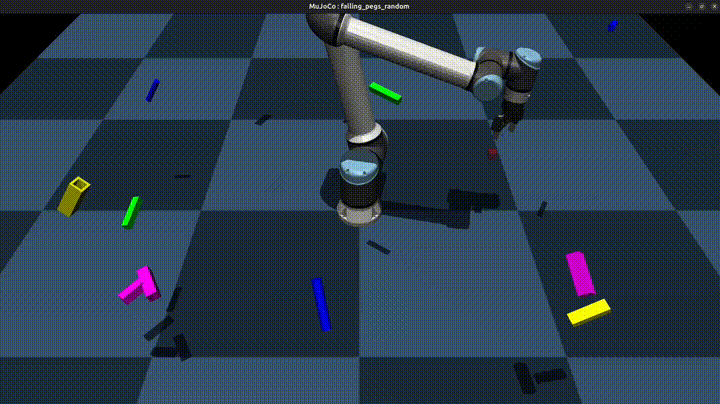

# PegSense
Universal Robots Visual Servoing in Sim (Mujoco) and Real (UR10e) for Peg-in-hole Insertion tasks.

  

## Credits

This project uses code and ideas from the following repositories:

- **[Manipulator-MuJoCo](https://github.com/ian-chuang/Manipulator-Mujoco)** – Baseline Gym environment
- **[mjctrl](https://github.com/kevinzakka/mjctrl)** – Baseline controller implementation

Special thanks to the original authors for their open-source contributions.   